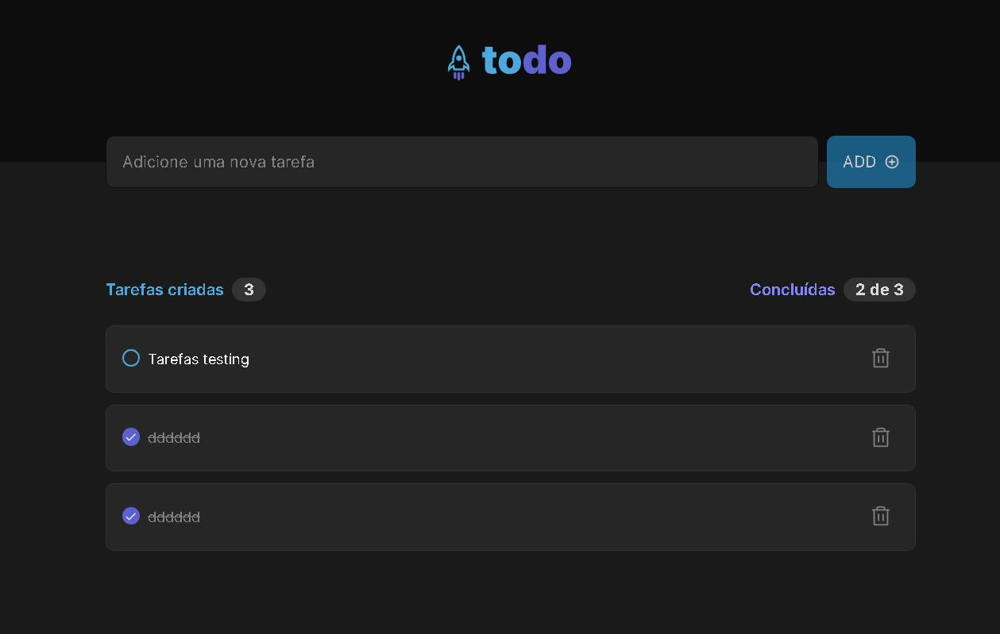

# React + TypeScript + Vite

This template provides a minimal setup to get the project working in your environment

## How to make it works
  ### Get the repository's url
    > Use git to clone the GitHub repository:
       git clone https://github.com/bchavs12/rocket-todo.git

  ### Get the project installed
    > Use NPM to install the project after cloned it
       npm install || npm -i

  ### Get the project started
    > Use NPM to start the project after installed it
       npm run dev

## Project interface and functionalities

## Functionalities
  ### Add todos
    - Input text need to have more then 5 words or number to be add to the list

  ### ToggleCheckedTodo
    - Check your tasks when you have completed them

  ### Delete Todos
    - Delete your tasks when you have completed them.
    - Delete your tasks when you don't needed them anymore.
  
  ### Task counter
    - Keep track of how many tasks you have on your to-do list

  ### Completed task counter
    - Keep track of how many tasks had you completed.